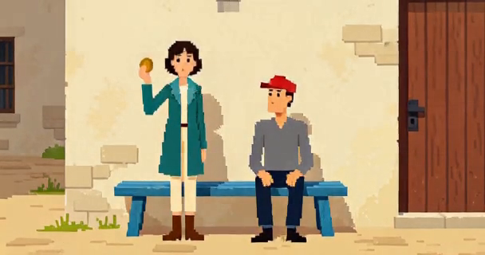
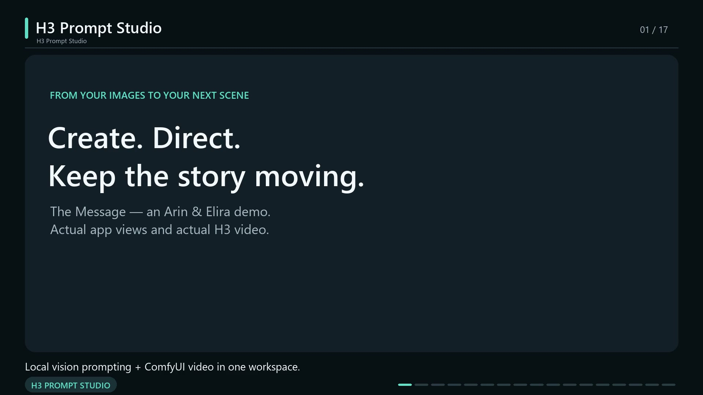

# H3 Prompt Studio

A local creative app with three separate workspaces: **Video** creates and reviews one clip up to 15 seconds; **Studio** directs a 1–10 minute film from connected 15-second clips; **Game** runs an interactive story with its own character and world state.

Version **1.7.0** adds named project creation, a clear saved-work home, explicit save status, a simpler responsive editor and a dedicated film storyboard with serial rendering, take review and final export. Qwen 3.8 **27B** in LM Studio writes and inspects; ComfyUI generates the footage. [Read the workspace and saving guide](docs/WORKSPACES.md).

**[Game scene and movement guide](docs/GAME_SCENE_MOVEMENT.md)** · **[Scene continuity](docs/SCENE_CONTINUITY.md)** · **[Research: H3 and 2025–2026 methods](docs/H3_SCENE_CONTROL_RESEARCH.md)** · **[Workspace validation](docs/WORKSPACE_SEPARATION_VALIDATION.md)** · **[Scene validation](docs/SCENE_CONTINUITY_VALIDATION.md)** · **[Changelog](CHANGELOG.md)**

The v1.3.0 [Coin Safety Inspector demonstration](demo/scene-continuity/README.md) exercises a seated bystander and a single prop across a continuous sequence. The demo record separates authored direction, generated video and visual review. The model can still make mistakes; prompt instructions are not a guarantee of physical consistency.

[](https://github.com/BesianSherifaj-AI/h3-prompt-studio/releases/download/v1.3.0/continuity-30s.mp4)

**[Watch the 30-second demo](https://github.com/BesianSherifaj-AI/h3-prompt-studio/releases/download/v1.3.0/continuity-30s.mp4)** · **[Chase, one-minute parody and Studio images](demo/scene-continuity/README.md)** · **[App releases](https://github.com/BesianSherifaj-AI/h3-prompt-studio/releases)**

The earlier **v1.0** [The Message demo](demo/README.md) remains available: three actual 0.3 MP scenes, ten shared reference images, exact dialogue, measured render times, and portable projects. Its showreel and measurements describe that release. The visual review includes observed model mistakes.

[](https://github.com/BesianSherifaj-AI/h3-prompt-studio/releases/download/v1.0.0/H3-Prompt-Studio-showreel.mp4)

**[Watch the v1.0 showreel](https://github.com/BesianSherifaj-AI/h3-prompt-studio/releases/download/v1.0.0/H3-Prompt-Studio-showreel.mp4)** · **[App releases](https://github.com/BesianSherifaj-AI/h3-prompt-studio/releases)** · **[Published example projects](https://github.com/BesianSherifaj-AI/h3-prompt-studio/releases/tag/v1.0.0)**

The showreel combines clearly labeled captures of the working app with real generated videos played at normal speed. It follows reference assignment, shot and dialogue direction, a completed take, seed comparison, three AI story choices, and a combined continuation. See [the test record](VERIFICATION.md) for what was verified.

## Production batches

Studio now includes **Production queue**. Queue saved projects, inspect individual receipts and videos, stop future work or explicitly resume after a restart. The API also supports optional Z-Image first frames, generated before the video phase to reduce model switching. Export a completed batch as a joined film or a ZIP of individually trimmed clips. Rendering success is separate from creative approval; review motion, identity and sound before publishing. See [production workflow](docs/PRODUCTION.md).

## What you can do

- Write precise opening/action/ending direction with the guided prompt writer and editable scene presets.
- Review imported local videos and generated takes, save verdicts and quality notes, and ask Qwen 3.8 27B for time-linked frame evidence and a repair prompt. See [local review guide](docs/LOCAL_VIDEO_REVIEW.md).

- Keep Video projects, Studio films and Game sessions separate, with independent resume choices and direct links to each workspace.
- Search saved videos, duplicate a project, import a portable backup, or export your work with its reference images. Save status reports whether your latest changes were saved.
- Plan a 1–10 minute film in Studio, edit its four-to-forty scenes, freeze a render queue, review each take and export the complete film.
- Recover unavailable saved videos with **Retry playback** and **Open Connections**. The player explains when the original ComfyUI server or video is unavailable.
- Assign faces, clothes, props, places, palettes, and styles to named characters. Reorder or replace images while keeping their tags and assignments.
- Write exact dialogue by speaker. Give each scene its own duration, framing, camera movement, transition, and ending.
- Direct each visible character's starting pose, action or hold, and ending. Track important props by stable identity, quantity, appearance and placement. Opening the continuity editor and inventory requires no model call.
- Keep the Video editor beside playback, with **Write**, **Photos · optional**, and **Settings** tabs; detailed authoring tools remain available under **More tools**.
- Generate a fresh video or **Try another take** from an existing take's exact prompt and settings.
- The advanced Video editor's **Continue from this ending** uses the active story endpoint, its saved motion, actual final frame and completed history. Browsing an older take does not move that endpoint; choose **Branch from this preview** to start another path.
- In Game, write a move or choose one of three suggested player actions. The assistant writes the other characters' actions and speaker-bound dialogue. Responses render automatically by default; optional review lets you edit them first.
- Select an inspected person, door or object beside the video, then approach it or talk. New games remember the player from their opening; **Change character** offers an explicit correction. Basic arrows use direct movement instructions; old scene positions are labelled until you request a fresh inspection.
- Generate needed character, outfit, prop or location references with an installed Z-Image-Turbo model. Existing identities and reference tags are reused; new visual elements use an explicit scene cut.
- Switch between the latest scene and the whole accepted story. Sequential playback needs no ComfyUI join job. Save the active branch as one film; compatible legacy continuation chains can still use **Combine clips**.
- Use named takes, favorites, side-by-side comparison, saved setups, and portable project ZIPs with references.
- Video and Studio share one local Qwen 3.8 27B profile; Game keeps its own model/context settings. Choose an installed 27B variant by its exact key; GPU hand-off lets the assistant and H3 take turns. See [assistant profiles](docs/ASSISTANT_PROFILES.md).
- Sketch a guide or plan simple movement, then add it as a reference or scene instruction.

No cloud account is required by this app. Reference photos, prompt drafts, stories and projects remain in the configured local data folder; the app sends them to the local LM Studio and ComfyUI services you configure.

## Install on Windows

Install [uv](https://docs.astral.sh/uv/getting-started/installation/), [Node.js 22.12 or newer](https://nodejs.org/), and [FFmpeg with ffprobe](https://ffmpeg.org/download.html). Both FFmpeg executables must be on `PATH`.

Download or clone this repository into a writable folder, then run in PowerShell:

```powershell
powershell -ExecutionPolicy Bypass -File .\Setup.ps1
powershell -ExecutionPolicy Bypass -File .\Launch.ps1
```

Setup creates a separate Python 3.12 environment and builds the frontend. After setup, double-click **Launch.cmd** to open [localhost:8766](http://127.0.0.1:8766). Launch also starts LM Studio's loopback server when its installed CLI is available and the server is offline. It does not start a render or load a model. Keep the folder after setup: it also holds your private project data. Use `Launch.ps1 -NoBrowser` to start without opening the browser or `-SkipLMStudio` to manage the LM Studio server yourself.

1. Install Qwen 3.8 **27B** in [LM Studio](https://lmstudio.ai/) if it is not already installed. The local launcher locks all assistant operations to this family, with `qwen3.8-27b@q4_k_s` as the initial exact key. In **Connection**, refresh and select another installed 27B variant if necessary. Choose a variant marked **Reads photos** for video frame review and Game inspection. The app never downloads models or substitutes a smaller model. Select **Prepare assistant** to verify the saved context and GPU placement before using AI.
2. Open ComfyUI with the H3 runtime described in [ComfyUI setup](COMFY_BRIDGE_SETUP.md). In **Connection**, keep only the local ComfyUI addresses you intend to use. The defaults cover standard ComfyUI (`8188`), Desktop (`8000`), and an alternate instance (`8010`). The app does not install ComfyUI, H3 models, LoRAs, or attention kernels.
3. Open **Video**, start a named project, and begin with **0.3 MP / 5 seconds**. Write your idea, then select **Prepare prompt**. Photos and detailed camera controls are optional. Manual prompt building is available under the optional controls.

The application also uses ordinary Python and Node tooling on other platforms, but the supplied launchers and GPU hand-off have been tested on Windows with an NVIDIA RTX 4090. A fresh macOS/Linux GPU installation has not been verified.

## Create a video or film

Open **Video** at [localhost:8766/video](http://127.0.0.1:8766/video) for one clip. Start a named video or resume work from **My videos**. Write your idea, choose up to 15 seconds, select **Prepare prompt**, and generate/review the take. Edits save automatically; **Backup & copy** provides duplication, import and portable export.

Open **Studio** at [localhost:8766/studio](http://127.0.0.1:8766/studio) for a film. Name it, choose 1–10 minutes, and plan its storyboard with Qwen 27B or write each clip yourself. Edit/reorder scenes, share reference photos and continuity notes, then **Create render queue**. Press **Start batch** to render. Review footage before using **Export film** or **Export clips ZIP**; optional trims refine delivery. Saving, planning and creating a queue never start rendering.

Old standalone Studio projects appear in Video. Existing files are preserved. Game keeps its own sessions. See [the full guide](docs/WORKSPACES.md) for saving, workspaces and the distinction between planned direction and approved footage.

The 0.3 MP preset is 736 × 416 in landscape. Quick drafts use a compatible four-step recipe; the quality preset uses eight steps. Those labels are practical comparison presets, not promises of fidelity. Actual timing depends on your hardware, prompt, reference count, model cache, and duration. See [workflow details](COMFY_FLOW.md) and [creative tools](CREATIVE_TOOLS.md).

## Play a story in Game

1. Open **Game** at [localhost:8766/game](http://127.0.0.1:8766/game), resume a saved game or enter a premise and choose the character you play. Video and Studio drafts are separate from Game. Reference photos are optional: a text-only premise can establish a location, nearby objects and new characters directly. **Create extra reference images** is off by default; enable it when you want the assistant to request separate reference images. That option requires an available image generator and adds a generation step. Existing references remain usable with it off.
2. New games default to **2D pixel art / 0.2 MP / three seconds / eight steps**. Landscape is 608 × 320; a fresh clip has 73 frames (3.04 seconds). Change style, quality, duration and viewpoint freely in the editor. Existing games retain their saved settings. Turn on **Review before rendering** to inspect the response before rendering.
3. Write a move such as `I look at the note and ask what it means.` Put exact spoken words in double quotes, for example `I say "Who sent this?"`. A response that changes quoted player speech is rejected before rendering.
4. Your player is established during the opening and remembered. If an older game has no saved player appearance, pressing Move opens **Who are you playing?** with the current picture and automatically finds people. Pick one to continue, or describe your character instead. **In this frame** provides other visible targets; visible objects are separate from saved inventory.
5. Basic directional arrows prepare movement directly from an accepted ending without a language-model call. Other item actions, dialogue, combat and situations governed by custom rules retain their appropriate planning path. Creative endings are inspected; basic movement endings are marked **not inspected**, with earlier positions shown as stale. Review the footage and refresh the scene inventory when needed.
6. Open **Scenes** to watch **Latest scene** or **Whole story**, inspect previous takes, and save the active branch as a film. This view is available on narrow screens too. A reroll replaces the current take within that turn; it does not append the same event twice. Compatible saved views can guide a return to an earlier position without restoring old inventory or character state.

The workspace switcher and the browser's Back and Forward controls move between Video, Studio and Game. Each workspace keeps its own selection. **Connections** and **Help** are shared, so service setup and usage guidance stay available from every workspace. Returning to a workspace preserves its mounted state.

The vision assistant distinguishes intended actions from what it sees in the final frame and records uncertainties. It cannot verify speech or lip sync from an image. Object ownership, handoffs and character consistency can still drift; review the video before building a long story on a mistaken result.

Open **Inventory** or type `open inventory` to see held and worn items immediately. Pick up, drop, give, open, close, inspect and move controls use the saved location and ownership rules. A locked door stays locked, unavailable characters cannot respond, and inspecting an item does not silently pick it up. **Quick item and movement actions** is enabled by default; turn it off when you want creative planning. Authored rules, guides, unusual conditions and incompatible scene controls can defer to that path so shortcuts cannot bypass them. See [scene selection, movement and return limits](docs/GAME_SCENE_MOVEMENT.md).

The assistant uses bounded corrections for eligible malformed responses, retains exact request receipts after a lost connection, and validates edited plans before rendering. Failed or cancelled turns do not advance accepted inventory or history. See the [local assistant comparison](docs/ASSISTANT_EVALUATION.md) for the tested model choice, measured latency and evaluation limits.

Use **Play** to act or speak; use **Guide** to change the next response or persistent story behavior. The side editor remains available during play: add/remove references, choose who wears/holds each item, edit personalities, choose aspect ratio and ordered LoRAs. Edits during rendering apply next turn. **What ran** exposes the compiled prompt, actual reference connections, seed and ComfyUI receipt.

**Supervised test assistant** pauses for an external tester to complete the saved role request. It is a diagnostic provider, not an autonomous assistant. Choose **LM Studio** for normal play. Small models can produce schema-valid but semantically invalid responses; a validation error must be fixed before video is queued.

Optional microphone input records first, transcribes into an editable message and never automatically sends a move. Original recordings can separately be selected as H3 audio references. Soundtrack mixing creates a separate preview. See [audio setup](AUDIO_SETUP.md).

**UPSCALE** buttons in Studio and Game open an existing installation's GUI, optionally adding the selected scene. It does not start processing. Install that app separately; set `H3_STUDIO_UPSCALE` to its folder if it is not in `Desktop/UPSCALE` or `OneDrive/Desktop/UPSCALE`. It supports video upscaling/interpolation, not still-image files.

The player shows live operation progress through a local event relay when ComfyUI sends it. The current H3 runtime supplies the playable clip after decoding; intermediate image previews are not shown.

## Optional image generation

**H3 still frame (experimental)** uses the installed FL2VA model, compatible four-step LoRA and five-frame generation, then saves the middle frame. This is a video-model workaround, not a dedicated image model or identity-preserving editor. A local 608 × 320 pixel courtyard completed in 50.1 seconds including loading. Keep **Z-Image-Turbo** selected when preferred; no fair head-to-head speed claim is made.

The configured baseline is **`z_image_turbo_bf16.safetensors`**. **`z_image_turbo_fp8_e4m3fn.safetensors`** is an optional alternative when installed and reported compatible; its availability is not a speed or quality guarantee. Initial BF16 and FP8 checks used different cache conditions, so they do not establish a fair speed comparison or justify changing the default. Both use ComfyUI's native image workflow with:

```text
models/diffusion_models/z_image_turbo_bf16.safetensors
models/text_encoders/qwen_3_4b.safetensors
models/vae/ae.safetensors
```

The optional FP8 file belongs in `models/diffusion_models/` too. The generator checks that the model, encoder, VAE and required nodes exist together on a configured ComfyUI instance. New reference images default to 512 × 512, eight steps and CFG 1. Missing requirements appear in Game's **New scene images** settings. The app does not download these model files.

The assistant, image model and H3 use the existing automatic GPU hand-off. Qwen 3.8 27B is unloaded before ComfyUI rendering, and ComfyUI releases its models when the assistant needs the GPU. The local 27B lock disables CPU residency. Opening settings or reading saved story state does not start generation.

## Continue, recover and measure duration

**New Studio continuations and Game scene length mean new action.** A saved-motion continuation adds its context before rounding to H3's frame grid. With the standard 39-frame context, a five-second new-action request generates 175 frames: about 7.292 seconds total, including 1.625 seconds of context and 5.667 seconds of new footage. The UI offers 4, 5, 7, 10 or 13 seconds of new action; source dimensions stay fixed during a continuous extension.

Legacy clips keep their original total-duration budget. A five-second legacy continuation is 124 frames: about 5.167 seconds total and 3.542 seconds new after its 39-frame context. Scene playback removes only the recorded context; original outputs remain available in clip details. Fresh scenes without a motion source have no context to remove. Rounding can add up to one frame-grid interval to the requested duration.

Turns and request IDs are saved before work starts. If a connection is interrupted, use the displayed **Resume** or **Retry** control to recover that same request. An uncertain submission is checked rather than blindly sent again. Reloading does not start a fresh turn. Failure or cancellation leaves the last completed story ending active; once the app confirms failure, an explicit retry can create a new render attempt.

## Storage and configuration

- Projects, reference images, drafts, and private run snapshots: `data/`.
- Stories, branches and turn records: `data/stories/`; generated-image jobs: `data/asset_runs/`.
- Cached exports of the active story branch: `data/story_films/`.
- Project backups exported with images: `data/exports/`.
- Local playback copies: `data/video_runs/<run ID>/playback.mp4` once a result is watched.
- Original video: the connected ComfyUI's `output/h3_prompt_studio/runs/<run ID>/`.
- Continuation state: ComfyUI's `output/mmh3/h3_prompt_studio/runs/<run ID>/`.

The **Outputs** button lists local folders. To enable shortcuts to the original ComfyUI files, set `H3_STUDIO_COMFY_OUTPUT` to your installation's actual `output` directory before launching. Set `H3_STUDIO_DATA` if you want Studio's private data elsewhere. These values are local configuration and should not be committed.

```powershell
$env:H3_STUDIO_COMFY_OUTPUT = 'D:\AI\ComfyUI\output'
$env:H3_STUDIO_DATA = 'D:\AI\H3StudioData'
.\Launch.ps1
```

Use **Export with images** for a portable project backup. Back up the complete data directory to retain story branches and turn records. Original ComfyUI videos and `.mmh3` continuation states are separate from a project export, so retain those too when you need to continue an old render.

Before upgrading, stop the existing Studio server and back up those files. Keep your data directory when replacing the application files, then launch the new version. The launcher reuses a compatible server already running on port 8766, so leaving an older server open can show the previous interface.

## Runtime requirements and limits

The bundled render recipe requires native MiniMax H3 ComfyUI nodes, MMH3 Media for saved-state continuation, the tested SLA attention node, compatible model files, and FFmpeg. Studio validates the installed node schema and reports missing components before submission. This is a local H3 workflow editor, not an implementation of MiniMax's hosted Context-IR service.

H3 uses 24 fps on its `17k + 5` frame grid, with a maximum 362 generated frames for this recipe. Initial Studio clips and legacy projects use their original total-duration budget; new continuations and Game turns leave space for motion context. The direct reference-image workflow supports up to nine conditioned images. Other photos can remain inspiration; direct audio/video reference conditioning is not implemented. The prompt assistant does not listen to audio. Supply exact speech and sound instructions in the editor.

## Development

```powershell
.\.venv\Scripts\python.exe -m pytest -q
node --test comfy_extension/tests/*.test.mjs
cd frontend
npm test
npm run build
```

The included tests use neutral fixtures and mocked model/GPU calls. They do not render your projects. `data`, `logs`, models, credentials, user exports, and local benchmark records are excluded from version control. The separate `demo/` folder contains the explicitly selected public example. See [third-party notices](THIRD_PARTY_NOTICES.md) for external components and model licensing boundaries.

After testing and building a reviewed release checkout, create its portable archive from the repository root:

```powershell
.\.venv\Scripts\python.exe tools/package_release.py --version 1.6.1 --output-dir release
```

The package includes the prebuilt `dist/` frontend, source, launchers, dependency locks, notices and selected public demo. It excludes runtime data, environments, logs, credentials and model files. The script writes a file-hash manifest and an archive SHA-256 sidecar, uses fixed ZIP metadata, and refuses to overwrite an existing release. Rebuilding or packaging never uploads anything.

This is an independent community tool and is not affiliated with MiniMax, ComfyUI, or LM Studio.

See [v1.1 live validation and visual limitations](VERIFICATION_V1.1.md) for the measured Studio/Game, image-generation, playback and recovery checks.
