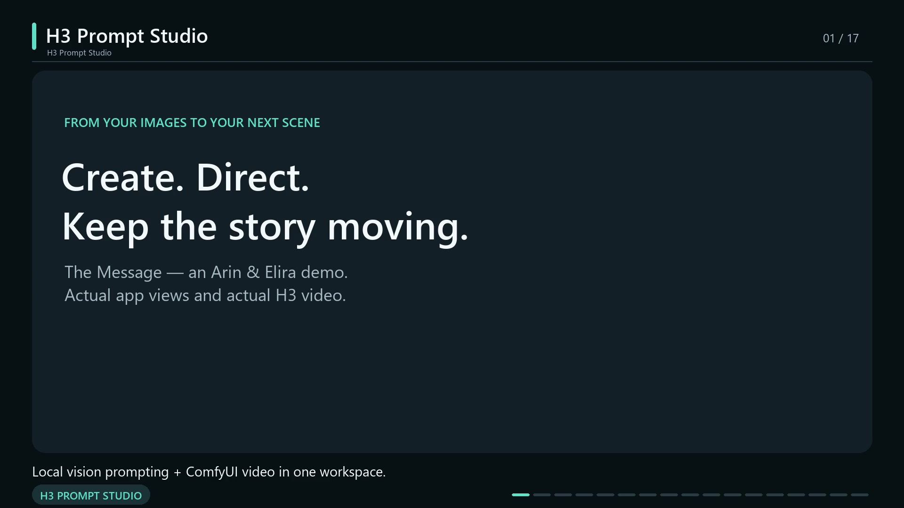

# The Message — a working H3 Prompt Studio example

Arin passes Elira a handwritten message in a café. A key leads them through a wet alley to a rooftop, where a lighter reveals the next clue. This example uses the repository owner's supplied images and authored brief, with separate controls for characters, clothes, objects, camera cuts, and exact dialogue.

These are actual local H3 outputs at **0.3 MP, eight steps**, with their original generated audio. The three scenes were authored and rendered independently; they are not presented as a saved-latent continuation chain.

[Watch/download the showreel](https://github.com/BesianSherifaj-AI/h3-prompt-studio/releases/download/v1.0.0/H3-Prompt-Studio-showreel.mp4) · [Captions](showreel.srt) · [Chapters](showreel-chapters.txt) · [Showreel verification](verification/showreel.json).

The 88-second app presentation is 1920 × 1080 at 30 fps, with 2,640 frames and a verified full decode. Its H3 source footage was generated at 736 × 416 and 24 fps. The reel combines real app views with those actual outputs.

## Watch and open the projects

- **Scene 1 · The handoff:** [video](clips/scene-1.mp4), [compiled prompt](prompts/scene-1.txt), [portable project with all ten images](https://github.com/BesianSherifaj-AI/h3-prompt-studio/releases/download/v1.0.0/The-Message-Scene-1.zip).
- **Scene 2 · The rooftop door:** [video](clips/scene-2.mp4), [compiled prompt](prompts/scene-2.txt), [portable project with all ten images](https://github.com/BesianSherifaj-AI/h3-prompt-studio/releases/download/v1.0.0/The-Message-Scene-2.zip).
- **Scene 3 · The hidden writing:** [video](clips/scene-3.mp4), [compiled prompt](prompts/scene-3.txt), [portable project with all ten images](https://github.com/BesianSherifaj-AI/h3-prompt-studio/releases/download/v1.0.0/The-Message-Scene-3.zip).

In Studio, choose **Saved projects → Import project** and select a downloaded ZIP. Each archive includes its tested project, reference PNGs, thumbnails, and reference metadata. It does not include models, original run history, or MMH3 continuation state. Importing prepares an editable project; rendering requires your compatible [ComfyUI installation](../COMFY_BRIDGE_SETUP.md).

The full-resolution reference images are also stored once in [references](references). The ZIP downloads repeat them so each project can be imported independently; the three large ZIPs are release assets rather than duplicate files in Git.

All three final ZIPs passed an isolated import test: photos, tags, roles, dialogue, and shot controls survived, and the compiled prompt matched the tested project exactly. See the [import check](verification/portable-import.json).

## Ten library images, eight video references

Every scene keeps the same ten-image library. Exactly **eight images condition that scene's video**: two faces, two outfits, three props, and the current location. The other two location images remain **Prompt inspiration only**. They do not receive extra H3 picture tokens. The header therefore reads **8 video references · 2 inspiration**.

- `@arin-face` and `@elira-face`: separate adult character identities.
- `@arin-outfit`: Arin's black jacket, charcoal shirt, dark trousers, chain, and sneakers.
- `@elira-outfit`: Elira's burgundy jacket, cream top, dark skirt, boots, and earrings.
- `@note`, `@key`, and `@lighter`: independently named props. The story defines their starting owner and when a handoff occurs.
- `@cafe`, `@alley`, and `@rooftop`: only the matching scene location is a video reference; the other two are inspiration.

The stable tags stay the same across all projects even though the active background changes. Studio compiles picture numbers from actual conditioned-image order. To replace a character or outfit, use the photo's **Edit photo → Replace** action so its tag and person assignment remain intact.

## Direct the three scenes

The brief contains three separate ten-second scenes. Open one project at a time instead of placing all three full descriptions into a single ten-second clip.

**Scene 1 uses four shot cards:** Arin's close-up, Elira's reverse close-up, a hand insert for the note transfer, then Elira reading. The authored shot durations are 3.6, 1.7, 2.0, and 2.7 seconds. Arin says “I found something you need to see.” Elira answers “Then stop hiding it.”

**Scene 2 uses five shot cards:** Arin reaching for the key, the key handoff, Elira's close-up, Arin's reverse close-up, then the door. Durations are 1.4, 1.1, 2.7, 2.1, and 2.7 seconds. Elira asks “This key came with the message?” Arin answers “It opens the rooftop door.”

**Scene 3 uses five shot cards:** Arin with the lighter, a lighter insert, Arin beside the note, Elira's reverse close-up, and a final two-shot. Durations are 1.6, 1.0, 3.6, 3.0, and 0.8 seconds. Arin says “Use the flame. There’s writing in the margin.” Elira answers “I see it. We do this together.”

Later cards use **Cut to a new shot**. The controls express intended timing and staging; the visual review below records where the model departed from them. These examples use authored instructions compiled by Studio. They are not evidence that the prompt assistant independently invented the script.

## Render settings and measured time

All three clips use Ref2VA at **736 × 416**, **24 fps**, **eight steps**, and the eight-step Turbo LoRA at strength 1.0. The H3 text encoder is `qwen3vl_32b_heretic_minimax_h3_nvfp4.safetensors`; attention is Kitchen SLA at 85% sparsity. These three renders use one Turbo LoRA each, so they do not constitute a visual test of an arbitrary multi-LoRA stack.

H3 aligns a ten-second authoring target to **243 frames / 10.125 seconds**. Each MP4 has H.264 video and stereo 32 kHz AAC audio. ComfyUI server execution took **100.658 seconds** for the café, **90.061 seconds** for the alley, and **88.228 seconds** for the rooftop on the tested RTX 4090 system. These are recorded render times, excluding prompt preparation and setup. They are not predictions for another computer.

All three files passed a full audio/video decode and matched their recorded SHA-256 hashes. Detailed, sanitized settings and results are in [manifest.json](manifest.json) and [verification](verification).

## What the outputs did well—and what to inspect

The sampled-frame review found consistent character identities and outfits across the intended locations, opposing close-ups, readable prop handoffs, and the rooftop ending. Scene 1 had no visible split-screen, captions, or subtitles in the sampled frames.

The café note is already partly unfolded before the designated unfolding beat, and the handoff begins early. The alley's exact key insertion, turn, and removal are compressed and not unambiguously visible in the sampled frames. On the rooftop, Elira's note/key hands appear reversed from the authored assignments, and a visible gap between the flame and paper is not consistently guaranteed. The paper remains intact. A sixteen-frame sample per clip cannot verify every moment.

An independent **faster-whisper / Whisper small** pass transcribed only the generated audio on CPU, without the expected script, speaker names, or hotwords. All **37 expected words across six lines matched**, ignoring case, punctuation, and apostrophe style. This is a wording check, not a lip-sync, speaker-assignment, voice-quality, intonation, or sound-effect test. Speech recognition itself can make mistakes.

## Tested reroll and interactive story

The café was rerendered with **Try another seed**: seed 908202601 became 908202602, the saved prompt hash stayed identical, and the decoded video pixels changed. **Café Take 2 took 87.263 seconds**. Its note folding and hand timing remain approximate. This second take became the source of the tested story branch.

**Continue video** used Café Take 2's actual final image and saved story context. **Qwen3.8-27B** loaded with the automatic GPU unload method and proposed three choices: **Elira Folds the Note**, **Arin Slides Out the Key**, and **Elira Tucks Note Away**. The selected second idea asked Arin to take the key from his right trouser pocket and hold it between his thumb and forefinger for Elira to see.

After a page reload and frontend rebuild, opening Continue restored the same three choices, the selected second idea, five-second length, and 0.3 MP / eight-step quality. The GUI displayed **Saved scene draft restored**. This was an observed live UI test, not an automated restoration assertion. The exact selected text also appears unchanged in the rendered continuation's saved project.

- [Watch the actual game continuation](clips/story-game.mp4): **77.741 seconds** of ComfyUI execution, **124 frames / about 5.167 seconds**. It includes 39 copied context frames and **85 new frames / about 3.542 seconds**.
- [Watch Café Take 2 plus the game branch](clips/cafe-story-combined.mp4): **20.096 seconds** to join and decode, **328 frames / about 13.667 seconds**. The calculation is 243 + 124 − 39 frames. The original Café Take 1 was not appended as another clip. Joining used the native latent path with no new diffusion.

The recorded Continue target on that combined film resolves to the game's final individual take. The three original location projects above remain separate examples; this combined video specifically demonstrates the Café Take 2 → key-reveal continuation chain.

The new branch preserves faces, outfits, and café appearance, and Arin visibly reaches for and reveals the key. Its ending nevertheless places the key in Elira's hand without a visible handoff, beyond the selected instruction, and the note is no longer visible. Review prop ownership before extending it further. The combined film preserves that same limitation. The earlier 37-word ASR check covers the three original location clips. A separate CPU Whisper small pass on the game clip returned an empty transcript, consistent with its intended absence of dialogue; it does not guarantee that every sound is non-speech or assess sound-effect quality. Reroll and combined-branch wording and voice quality were not independently checked.

The two public branch MP4s have embedded workflow metadata removed because the source files included local ComfyUI cache paths. FFmpeg stream copy preserved the encoded media; complete decoded video and audio hashes match the untouched originals. [Interactive-story verification](verification/interactive-story.json) records the timings, choices, observed restoration, lineage, public/source hashes, and limitations.

## Try the app's other tools

After importing a project, enable **Save continuation state** when you generate a take if you want to extend it. Its original MMH3 state stays in your ComfyUI output folder. Portable prompt-project ZIPs do not contain those large working states.

Use templates to save a camera or writing approach, and sketch/movement guides when a spatial relationship is hard to describe. See the [main workflow guide](../COMFY_FLOW.md) and [creative tools guide](../CREATIVE_TOOLS.md) for these controls.

## Reference provenance

The repository owner supplied the reference images and creative brief for this demonstration and requested publication of the tested app and examples. Model weights and unrelated downloads are not included. These references and generated clips have separate rights from application source code; no blanket third-party asset or model license is granted here. Consult [third-party notices](../THIRD_PARTY_NOTICES.md) before redistribution outside this demonstration.
