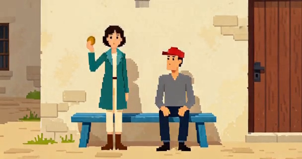
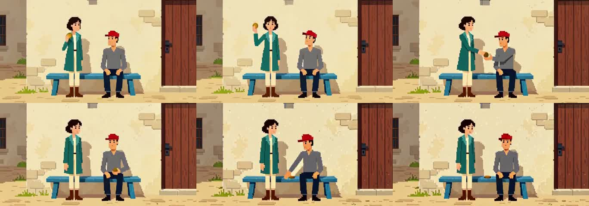
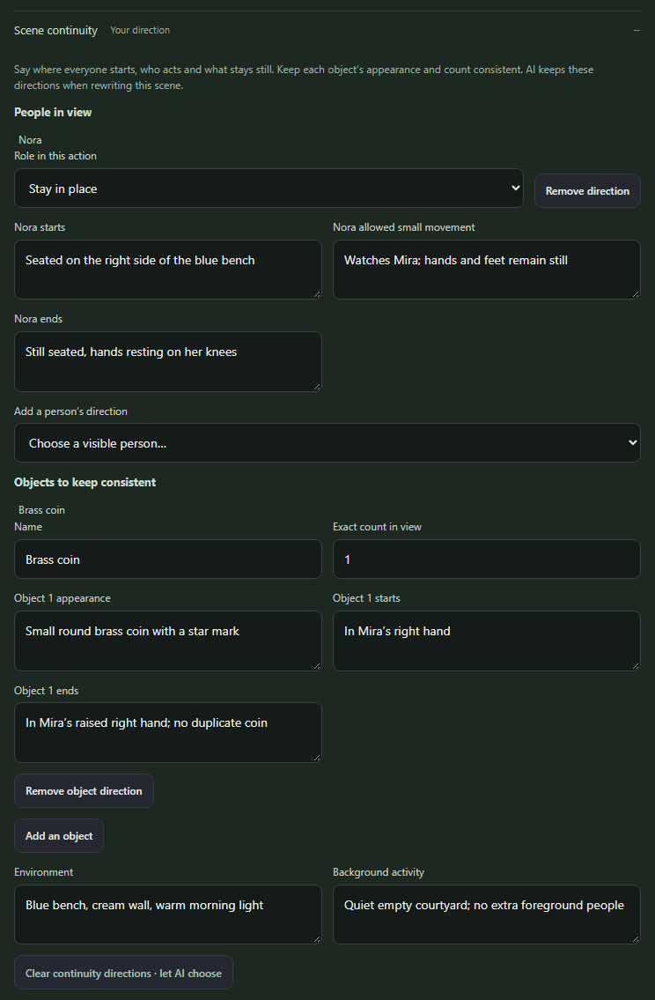
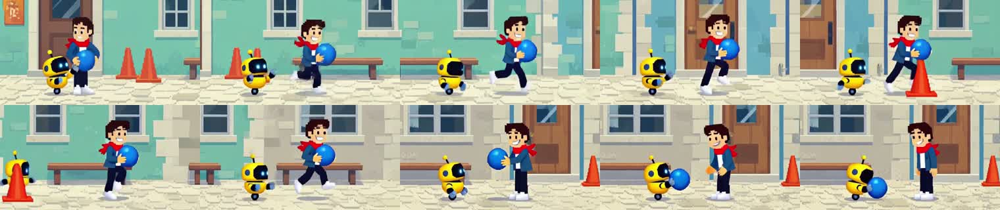
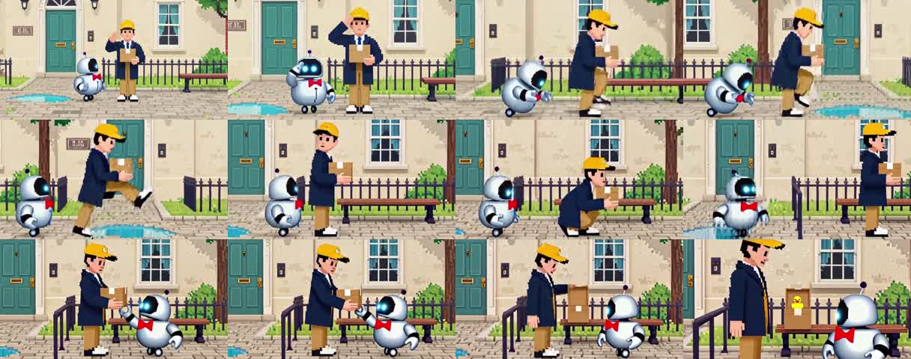

# Scene continuity demos

These are actual H3 render examples and a screenshot of the built Studio interface. The films use original authored direction and saved-motion continuation. They are not autonomous-writing benchmarks or evidence that H3 always follows a prompt.

## New: The Coin Safety Inspector

**[Watch the new 30-second film](https://github.com/BesianSherifaj-AI/h3-prompt-studio/releases/download/v1.3.0/continuity-30s.mp4)** · [Authored contracts, render timings and checksums](coin-provenance.json)

Mira solemnly presents a single brass coin to seated Ivo. He accepts that coin, then gives it an equally solemn place on the bench. All three shots explicitly direct his seated pose, both characters' colors and clothing, one coin and one blue bench, and each prop's starting and ending placement.

Three actual ten-second scenes were generated from text at **0.2 MP, eight steps, 608×320**, using saved motion between scenes. The finished file contains **720 frames at 24 fps, exactly 30.0 seconds of video**, plus native audio. H3 reported **84.400, 81.064 and 81.015 seconds** of execution. These are observed job times, not a controlled speed benchmark.

Review used one-second samples throughout, with four samples per second during the handoff's first five seconds. The sampled sequence shows one coin moving from Mira to Ivo and then onto the bench, while Ivo remains seated and Mira ends empty-handed. The stylized transfer does not reliably distinguish the prescribed left/right hands; static door/window details were added to the courtyard, and subtle comic facial acting is limited. Sampling and final-frame inspection cannot certify every intervening frame.

All three ending inspections completed. Their optional structured continuity reports contained four, zero and three entries respectively, so they must not be described as exhaustive visual verification. The original reports and directing contracts are preserved in the provenance record. No poses, hands or objects were corrected in post-production.

This missing coverage led to stricter fresh inspections in the release. Three separate new requests using the same final frames each returned all four required assessments and passed the strict validator, taking **8.34, 8.61 and 8.25 seconds**. The model labelled all twelve assessments as matches. The video and accepted story were unchanged. Complete coverage is still not proof that the model's assessments—or every intervening frame—are correct.

## Direct the cast and props

The screenshot shows the real production interface with a synthetic example and mocked API. It demonstrates editable actor holds, object count and placement; it is not a generated video frame. [Screenshot provenance](studio-controls-provenance.json)

## Earlier 30-second chase

**A Very Polite Pursuit** follows a runner and a small yellow robot before the blue ball changes hands. Three actual ten-second scenes, 0.2 MP, four steps, 608×320, 720 frames at 24 fps, with original audio.

[Watch or download the 30-second chase](https://github.com/BesianSherifaj-AI/h3-prompt-studio/releases/download/v1.3.0/chase-30s.mp4). The handoff is readable in the sampled frames. The output uses shaded cartoon forms rather than strictly flat sprites, and the cone maneuver is approximate.

## Earlier one-minute parody

**The Extremely Important Parcel** turns a simple delivery into an over-serious procession, ending in a yellow-duck reveal. Six actual ten-second scenes, 0.2 MP, eight steps, 608×320, 1,440 frames at 24 fps, with original audio.

[Watch or download the one-minute parody](https://github.com/BesianSherifaj-AI/h3-prompt-studio/releases/download/v1.3.0/parody-60s.mp4). Sampled frames preserve the main characters and parcel, with exaggerated salutes and a clear final reveal. The crouch does not convincingly depict passing underneath the rail.

These two films were rendered earlier during the reliability work, before the new scene-contract compiler. They are published here with their original bytes and observed limitations. [Film provenance and checksums](earlier-films-provenance.json) · [Earlier validation and timing](../../docs/VALIDATION_2026-09-09.md)

## Reproduce and inspect

[render_scene_control_demo.py](../../scripts/render_scene_control_demo.py) prepares the coin demonstration without connecting to a server. [render_story_examples.py](../../scripts/render_story_examples.py) prepares the chase and parody. Add `--execute` only when an isolated local QA app and compatible H3 runtime are ready; preparation alone performs no inference. Resume with the original output directory to reconcile saved requests instead of submitting them twice.

Exports trim each new scene to its requested duration and concatenate the actual frames at normal speed. They retain the native audio and do not repair objects or poses in post-production. Source clips, prompts and request receipts are retained in the local QA evidence. Render seeds make a run inspectable; they do not guarantee identical output across runtime versions and hardware.

Quoted film durations describe the video streams. AAC padding makes the container duration about 21 milliseconds longer; provenance records list video, audio and container durations separately.

See the [scene continuity guide](../../docs/SCENE_CONTINUITY.md), [research review](../../docs/H3_SCENE_CONTROL_RESEARCH.md), and [release validation](../../docs/SCENE_CONTINUITY_VALIDATION.md) for implementation details and evaluation limits.
